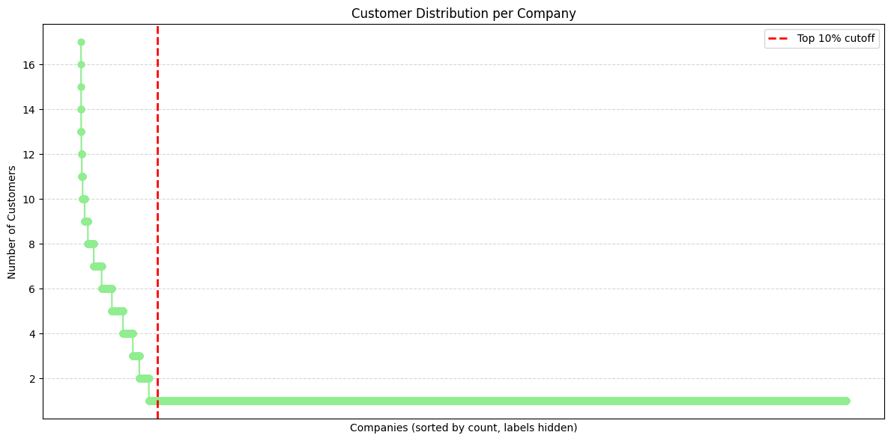

# Coding Test 1 - Insight Extraction

<table>
  <tr>
    <td></td>
    <td></td>
    <td></td>
  </tr>
</table>

### Total Account Insight - Country
- **Congo** and **Korea** rank as the top 1 and 2 countries in terms of account size, each holding **roughly double the number of accounts** compared to the other countries in the top 10.  
- Despite this, the **top 10 countries together account for only 11.4% of the total accounts**, indicating that most accounts are distributed among other countries.  
- The **average number of customers per country** is approximately **411.5**, with a **standard deviation of around 42.7** (≈10% of the mean).  
- **Conclusion:** While Congo and Korea dominate the top spots, the remaining countries have a **relatively similar number of customers**, suggesting a fairly even distribution outside the top two.

<table>
  <tr>
    <td></td>
    <td></td>
    <td></td>
  </tr>
</table>

### Total Account Insight - Country - City

<table>
  <tr>
    <td></td>
    <td></td>
    <td></td>
  </tr>
</table>

### Total Account Insight - Company

<table>
  <tr>
    <td></td>
    <td></td>
    <td></td>
  </tr>
</table>

### Historical Growth Analysis

