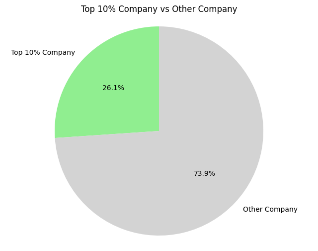

# Coding Test 1 - Insight Extraction

### Total Account Insight - Country

<table>
  <tr>
    <td></td>
    <td></td>
    <td></td>
  </tr>
</table>

- **Congo** and **Korea** rank as the top 1 and 2 countries in terms of account size, each holding **roughly double the number of accounts** compared to the other countries in the top 10.  
- The **top 10 countries together account for only 11.4% of the total accounts**, indicating that most accounts are distributed among other countries.  
- The **average number of customers per country** is approximately **411.5**, with a **standard deviation of around 42.7** (≈10% of the mean).  
- **Conclusion:** While Congo and Korea dominate the top spots, the remaining countries have a **relatively similar number of customers**, suggesting a fairly even distribution outside the top two.

### Total Account Insight - Country - City

<table>
  <tr>
    <td></td>
    <td></td>
    <td></td>
  </tr>
</table>

- I am tying to see whether any particular city that interesting in term of number of customer for each countries. Number of customer retained on city from each country have similar characterstic spread.
- **Conclusion:** There are no cities that stand out as significantly more interesting or dominant in terms of customer numbers within each country. The distribution of retained customers across cities appears relatively consistent, suggesting that customer retention behavior is similar. This indicates that city is not a key differentiating factor for customer retention.

### Total Account Insight - Company

<table>
  <tr>
    <td></td>
    <td></td>
    <td></td>
  </tr>
</table>

- The top 10 companies are closely matched in terms of customer count, averaging around 19 customers each.
- The **top 10% companies together account for only 26.1% of the total accounts**, indicating that most accounts are relatively distributed among other countries.  
- The **average number of customers per company** is approximately **1.39**, with a **standard deviation of around 1.44**.  
- **Conclusion:** The top 10% of companies account for roughly 26.1% of total accounts indicates a moderate level of market concentration. Although, the majority of customers are still spread across many smaller firms supported by low average number of customers per company (1.39) and relatively high standard deviation (1.44) further suggest a diverse and fragmented customer base.

### Historical Growth Analysis

<table>
  <tr>
    <td></td>
    <td></td>
  </tr>
</table>

- The cumulative growth follows a nearly **linear trend** with an average growth rate of approximately **3,167 customers per month**.
- The top three months with the largest declines in customer growth were **2021-03, 2022-03, and 2022-07**.
- **Conclusion:** The steady, linear growth suggests that customer acquisition strategies are generally effective, but the recurring dips highlight periods of vulnerability which may need further analysis to ensure overal growth consistency.
  
<table>
  <tr>
    <td></td>
    <td></td>
    <td></td>
  </tr>
</table>

- **2021-03:** Cocos, Haiti, and Barbados experienced the largest negative deviations from their average customer growth.  
- **2022-03:** Madagascar, Serbia, and Belgium experienced the largest negative deviations from their average customer growth.  
- **2022-07:** Turkey, French Southern Territories, and Syria experienced the largest negative deviations from their average customer growth.     
- **Conclusion:** Certain countries periodically underperform relative to their average growth, highlighting regional vulnerabilities in customer acquisition.

