# Coding Test 2 - Insight Extraction

### Total Account Insight - Country

<table>
  <tr>
    <td>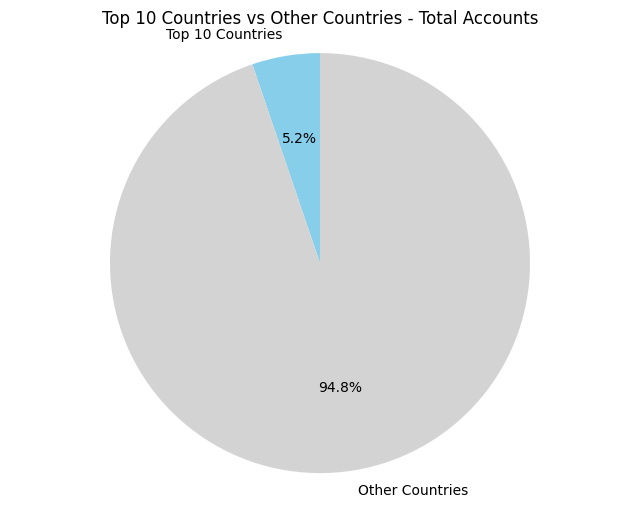</td>
    <td>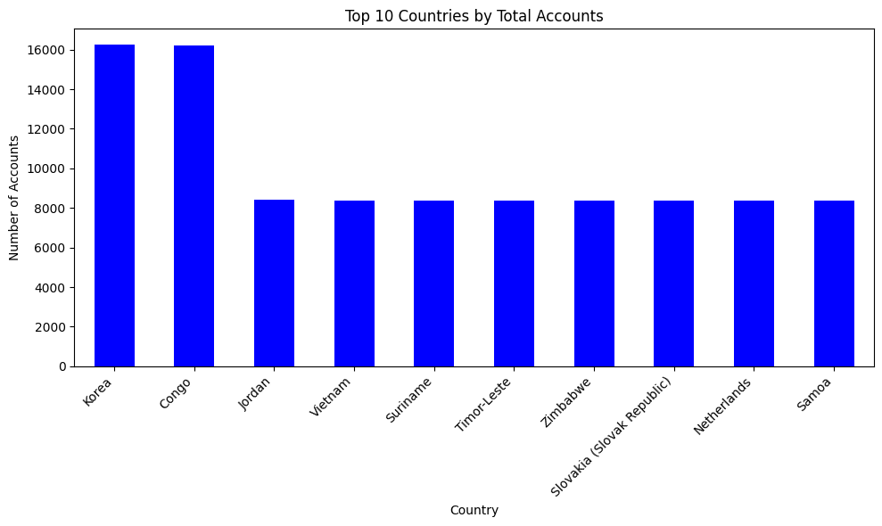</td>
    <td>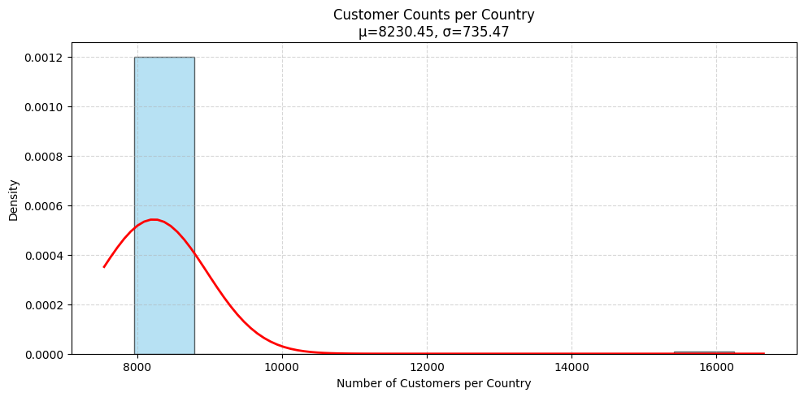</td>
  </tr>
</table>

- **Congo** and **Korea** rank as the top 1 and 2 countries in terms of account size, each holding **roughly double the number of accounts** compared to the other countries in the top 10.  
- Despite this, the **top 10 countries together account for only 5.2% of the total accounts**, indicating that most accounts are distributed among other countries.  
- The **average number of customers per country** is approximately **8230.45**, with a **standard deviation of around 735.47** (≈9% of the mean).  
- **Conclusion:** Although Congo and Korea stand out, with the top 10 accounting for only 5.2% of total accounts. This indicates a broadly distributed customer base and opportunities across many countries rather than concentration in a few.

### Total Account Insight - Country - City

<table>
  <tr>
    <td></td>
    <td>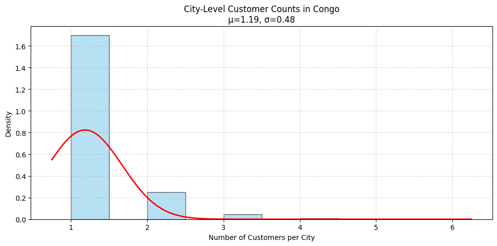</td>
    <td>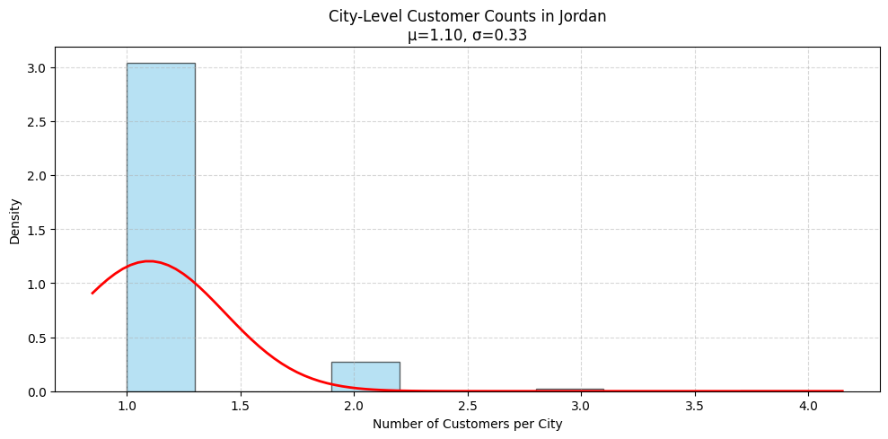</td>
  </tr>
</table>

- I am tying to see whether any particular city that interesting in term of number of customer for each countries. Number of customer retained on city from each country have similar characterstic spread.
- **Conclusion:** There are no cities that stand out as significantly more interesting or dominant in terms of customer numbers within each country. The distribution of retained customers across cities appears relatively consistent, suggesting that customer retention behavior is similar. This indicates that city is not a key differentiating factor for customer retention.

### Total Account Insight - Company

<table>
  <tr>
    <td>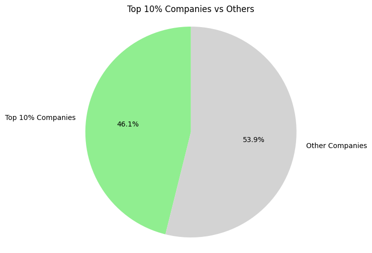</td>
    <td>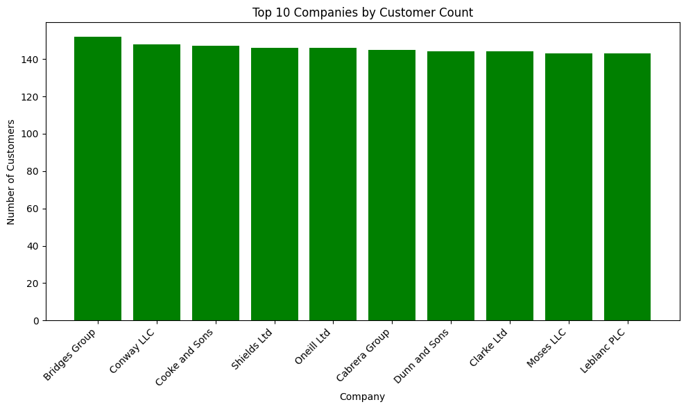</td>
    <td>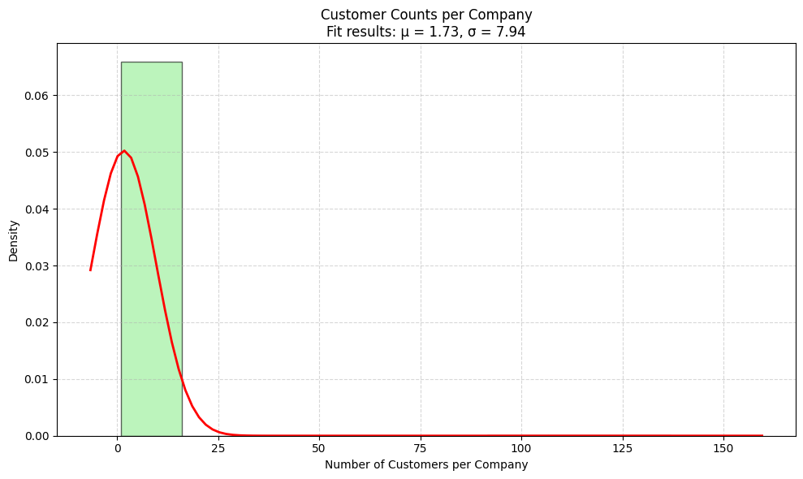</td>
  </tr>
</table>

- The top 10 companies are closely matched in terms of customer count, averaging around 130 customers each.
- The top 10% companies together account for **46.1% of the total accounts**.
- The **average number of customers per company** is approximately **1.73**, with a **standard deviation of around 7.94**.  
- **Conclusion:** The market is **moderately concentrated**, with the top 10% of companies holding nearly half of all accounts, while the majority of companies manage very few customers.

### Historical Growth Analysis

<table>
  <tr>
    <td>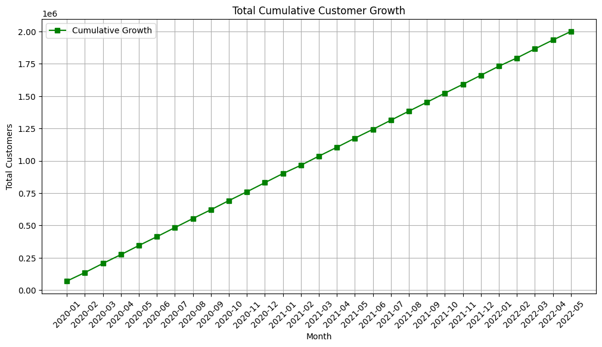</td>
    <td>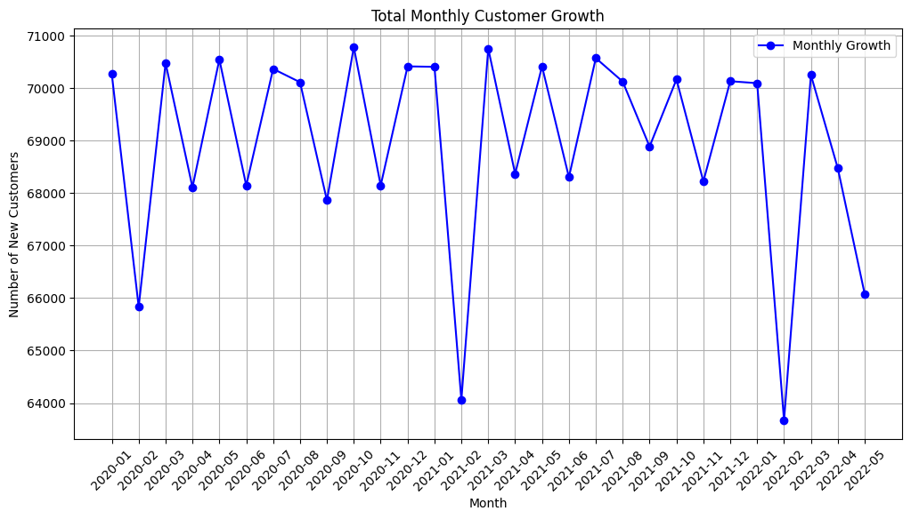</td>
  </tr>
</table>

- The cumulative growth follows a nearly **linear trend** with an average growth rate of approximately **68k customers per month**.
- The top 4 months with the largest declines in customer growth were **2020-02, 2021-02, 2022-02**.
- **Conclusion:** Customer growth has been steady overall, with a few notable dips in February of each year.

<table>
  <tr>
    <td>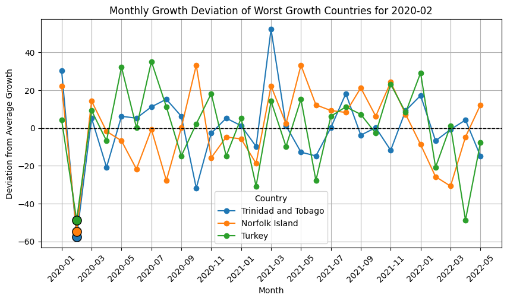</td>
    <td>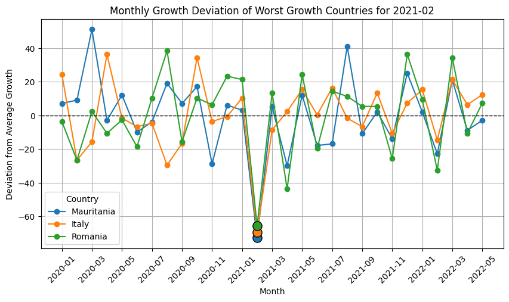</td>
    <td>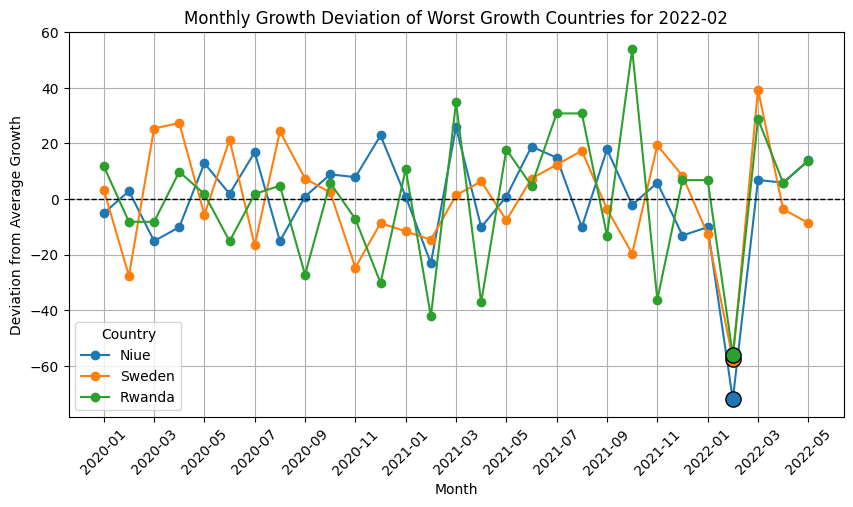</td>
  </tr>
</table>

- **2022-02:** Niue, Sweden, and Rwanda experienced the largest negative deviations from their average customer growth.  
- **2021-02:** Mauritania, Itali, and Romania experienced the largest negative deviations from their average customer growth.  
- **2020-02:** Trinidad Tobago, Turkey, and Norflok experienced the largest negative deviations from their average customer growth.     
- **Conclusion:** Certain countries periodically underperform relative to their average growth, highlighting regional vulnerabilities in customer acquisition. Focusing resources on these markets during high-risk periods could help stabilize growth and improve overall performance.
